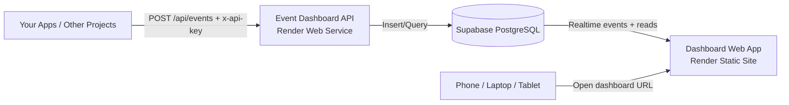

# Event Dashboard

[](https://dashboard.render.com/blueprint/new?repo=https://github.com/Pipin-Man/Week-2---EventsDashboard)

A full event monitoring app with:
- A remote REST API for event ingestion (API key auth)
- A dashboard UI for live feed, charts, insights, alerts, and API playground
- Supabase cloud database + realtime updates

## 10-Minute Getting Started (First Time)
If this is your first full-stack project, follow only these steps:

1. **Create Supabase project + schema**
   - In Supabase SQL Editor, run [`sql/supabase.sql`](./sql/supabase.sql).
2. **Push this repo to GitHub**
   - Render deploy needs your latest code in GitHub.
3. **Deploy on Render (one click)**
   - Click the **Deploy to Render** button at the top of this README.
4. **Set Render environment variables**
   - API service: `SUPABASE_URL`, `SUPABASE_SERVICE_ROLE_KEY`, `PROJECT_CREATION_TOKEN`
   - Web service: `VITE_SUPABASE_URL`, `VITE_SUPABASE_ANON_KEY`, `VITE_API_BASE_URL` (your API URL)
5. **Open your dashboard URL**
   - Create a project in the **Projects** tab to generate your first API key.
6. **Send your first event**
   - Use Playground page or `POST /api/events` with `x-api-key`.

After this, the app is live and accessible from other devices.
## What This Project Is
If you are new to terms like "stack" or "tech", here is the simple version:
- **Backend/API**: the server part (`api/`) that accepts events from apps.
- **Frontend/Dashboard**: the website part (`dashboard/`) where you view data.
- **Database**: where your data is stored (Supabase).

So the app is split into two deployable parts:
1. **API** (should be online all the time)
2. **Dashboard** (web app you open in browser from any device)

## Architecture (Simple View)

## Tech Stack (Beginner-Friendly)
- **Language**: TypeScript (both API and dashboard)
- **API server**: Node.js + Express + Zod validation
- **Dashboard**: React + Vite + React Router
- **Charts**: Recharts
- **Database + realtime**: Supabase (PostgreSQL + Realtime)
- **Hosting**: Render (Blueprint via `render.yaml`)

## Features
- `POST /api/events` with API key authentication
- Per-project API key generation, rotation, and revocation
- Projects page to create/select project
- Real-time feed (new events appear instantly)
- Search + channel filters + pagination (25/50/100/all)
- Shared date range filter across Feed / Charts / Insights
- Charts page:
  - Events per day line chart
  - Channel distribution doughnut chart
  - Per-channel activity bar charts
- Insights page with auto-refresh every 15 seconds
- Exports:
  - Feed to CSV
  - Insights snapshot to JSON
- Alerts page with spike rules (for example, errors spike)
- API Playground page with live `fetch()` preview and submit

## Project Structure

```text
api/          # Express API (event ingestion, project/key management, insights)
dashboard/    # React dashboard
sql/          # Supabase SQL schema/migrations
render.yaml   # Render Blueprint (deploy API + dashboard)
```

## Local Setup (Development)

### 1. Install dependencies

```powershell
cd "C:\Users\pipin\Desktop\GitHub\Week-2 - EventDashboard"
npm.cmd install
```

### 2. Create Supabase schema
1. Open your Supabase project.
2. Go to SQL Editor.
3. Run [`sql/supabase.sql`](./sql/supabase.sql).

If your database existed before insights were added, also run:
- [`sql/insights-migration.sql`](./sql/insights-migration.sql)

### 3. Configure API env

```powershell
cd api
Copy-Item .env.example .env -Force
notepad .env
```

Set:

```env
PORT=3000
SUPABASE_URL=https://YOUR_PROJECT_REF.supabase.co
SUPABASE_SERVICE_ROLE_KEY=YOUR_SUPABASE_SERVICE_ROLE_KEY
PROJECT_CREATION_TOKEN=choose-a-secret-token
```

### 4. Configure dashboard env

```powershell
cd ..\dashboard
Copy-Item .env.example .env -Force
notepad .env
```

Set:

```env
VITE_SUPABASE_URL=https://YOUR_PROJECT_REF.supabase.co
VITE_SUPABASE_ANON_KEY=YOUR_SUPABASE_ANON_KEY
VITE_API_BASE_URL=http://localhost:3000
```

### 5. Run API + dashboard
Use two terminals:

```powershell
# Terminal 1 (repo root)
npm.cmd run dev:api
```

```powershell
# Terminal 2 (repo root)
npm.cmd run dev:dashboard
```

Open: `http://localhost:5173`

## Quick Test (Create project and send event)

### Create project + get full API key

```powershell
$response = Invoke-RestMethod -Method POST `
  -Uri "http://localhost:3000/api/projects" `
  -ContentType "application/json" `
  -Body (@{ name = "My Project"; creationToken = "choose-a-secret-token" } | ConvertTo-Json)

$response.apiKey
```

### Send event

```powershell
$event = @{
  channel = "deploys"
  title = "First event"
  description = "hello dashboard"
  emoji = ":rocket:"
  tags = @("test")
} | ConvertTo-Json

Invoke-RestMethod -Method POST `
  -Uri "http://localhost:3000/api/events" `
  -Headers @{ "x-api-key" = "PASTE_FULL_API_KEY" } `
  -ContentType "application/json" `
  -Body $event
```

## Sample Data Import
You can import demo data JSON files (for example `ecommerce-demo.json`).

```powershell
# from repo root
npm.cmd --workspace api run import:sample -- .\ecommerce-demo.json
```

The script creates a project, inserts events with realistic timestamps, upserts insights, and prints the generated API key.

## Full Deployment Walkthrough (Web + Other Devices)

This deploys both API and dashboard to Render so they are accessible from anywhere.

### 1. Push latest code to GitHub
In GitHub Desktop:
1. Commit all changes.
2. Push to `origin/main`.

### 2. Start Blueprint deploy
Click the button at the top of this README, or use:
- [Render Blueprint Link](https://dashboard.render.com/blueprint/new?repo=https://github.com/Pipin-Man/Week-2---EventsDashboard)

### 3. Render creates 2 services
From [`render.yaml`](./render.yaml):
- `event-dashboard-api` (Node web service)
- `event-dashboard-web` (static dashboard)

### 4. Fill environment variables in Render

#### For `event-dashboard-api`
- `SUPABASE_URL`
- `SUPABASE_SERVICE_ROLE_KEY`
- `PROJECT_CREATION_TOKEN`

#### For `event-dashboard-web`
- `VITE_SUPABASE_URL`
- `VITE_SUPABASE_ANON_KEY`
- `VITE_API_BASE_URL` -> set to your API URL (for example: `https://event-dashboard-api.onrender.com`)

### 5. Deploy and verify
1. Wait for API deploy.
2. Open API health endpoint:
   - `https://<your-api-service>.onrender.com/api/health`
   - Expect: `{"ok":true}`
3. Open dashboard:
   - `https://<your-web-service>.onrender.com`
4. In dashboard, create/select a project.

### 6. Test from another device
- Open the dashboard URL from your phone/tablet/laptop.
- Send an event to the API URL from any machine/tool using a valid API key.
- Confirm event appears in Feed.

### 7. Important note about always-on
Render Free plan can sleep after inactivity. For a more always-on API, use at least **Starter** plan for the API service.

## API Reference (Short)

### `GET /api/health`
Returns API health.

### `POST /api/projects`
Creates project + API key.

Body:

```json
{
  "name": "My Project",
  "creationToken": "your-secret"
}
```

### `POST /api/projects/:projectId/rotate-key`
Rotates API key for a project (requires `creationToken`).

### `POST /api/projects/:projectId/revoke-key`
Revokes current API key for a project (requires `creationToken`).

### `POST /api/events`
Requires `x-api-key` header.

Body:

```json
{
  "channel": "orders",
  "title": "Order #1532 paid",
  "description": "Optional",
  "emoji": ":package:",
  "tags": ["vip", "stripe"]
}
```

### `POST /api/insight`
Upserts insight by title for the authenticated project.

### `GET /api/insights?projectId=<uuid>&startDate=YYYY-MM-DD&endDate=YYYY-MM-DD`
Gets insights for project and optional date range.

## Troubleshooting

### PowerShell blocks npm scripts
Use:

```powershell
npm.cmd run dev:api
npm.cmd run dev:dashboard
```

### `tsx` is not recognized
Run install from repo root:

```powershell
npm.cmd install
```

### Dashboard blank or cannot load data
- Check `dashboard/.env` values.
- Restart Vite after editing `.env`.
- Verify API URL and Supabase keys.

### `Invalid creation token`
Token in request must exactly match `PROJECT_CREATION_TOKEN`.

### API health works but other routes fail
- Ensure you call a real endpoint (`/api/projects`, `/api/events`, etc.).
- `{"error":"Not found."}` means wrong path.

## Security Notes
- Never expose `SUPABASE_SERVICE_ROLE_KEY` in frontend.
- Keep `PROJECT_CREATION_TOKEN` private.
- Rotate keys if you suspect leak.

## License
Personal/learning project. Add your preferred license if needed.


